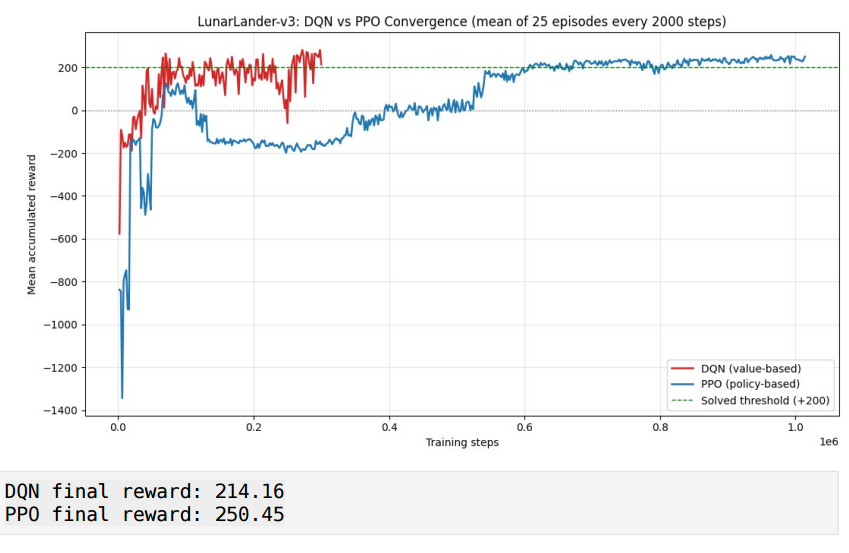
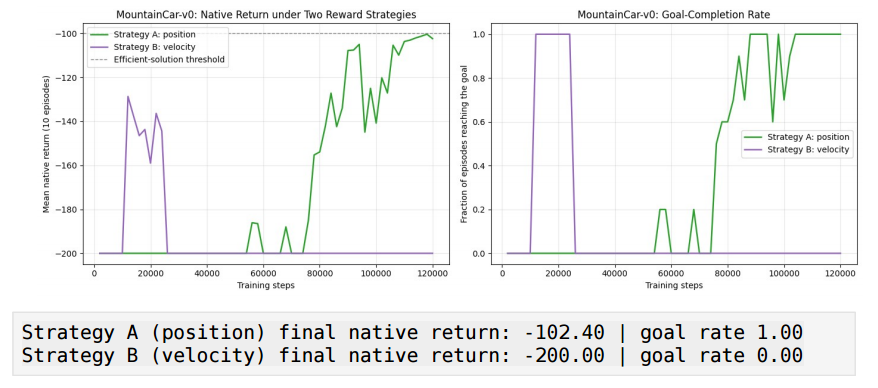

# Deep RL & Reward Dynamics Benchmark 🚀

A modular Reinforcement Learning pipeline designed to benchmark value-based and policy-gradient methods across discrete, continuous, and pixel-based environments. This project specifically explores solutions to partial observability and sparse-reward bottlenecks.

## 🧠 Core Architectures & Environments

1. **Tabular Q-Learning (`Taxi-v4`)**
   - Engineered a temporal-difference learning engine from scratch with an exponentially decaying epsilon-greedy policy. 
2. **Continuous Control (`LunarLander-v3`)**
   - Benchmarked value-based **DQN** against policy-gradient **PPO** in a continuous state space.
3. **Pixel-Based Vision & Temporal Aggregation (`AirRaid`)**
   - Implemented a CNN-based PPO architecture. Overcame spatial-only blindness by engineering a preprocessing pipeline using 3-frame stacking and a frame skip of 6.
4. **Reward Shaping & "Reward Hacking" (`MountainCar-v0`)**
   - Designed custom environment wrappers to test potential-based reward shaping against velocity-based heuristics, explicitly demonstrating how poorly designed dense rewards lead to reward hacking.

## 💻 Repository Structure
```text
├── assets/                  # Convergence graphs and evaluation visuals
├── src/
│   ├── common/              # Hardware selection, deterministic seeding, custom callbacks
│   ├── continuous/          # DQN and vectorized PPO pipelines
│   ├── reward_shaping/      # Custom Gym wrappers for reward engineering
│   ├── tabular/             # Custom Q-Learning TD engine
│   └── vision/              # Frame-stacking wrappers and CNN policies
├── requirements.txt         # Dependency lockfile
└── README.md

```

## Quick Start

To replicate the deterministic environments locally:

```bash
# 1. Clone the repository
git clone https://github.com/NikhilAdhikari089/deep-rl-reward-dynamics.git
cd deep-rl-reward-dynamics

# 2. Install dependencies
pip install -r requirements.txt

# 3. Execute a pipeline (e.g., Continuous Control)
python -m src.continuous.lunar_lander
```


## Evaluation & Results

### Continuous Control Performance
*Value-based vs. Policy-gradient convergence in continuous state spaces.*
<div align="center">
  
</div>

### Reward Engineering Dynamics
*Demonstrating vulnerability to 'Reward Hacking' (Strategy B) vs. Potential-based Shaping (Strategy A).*
<div align="center">
  
</div>